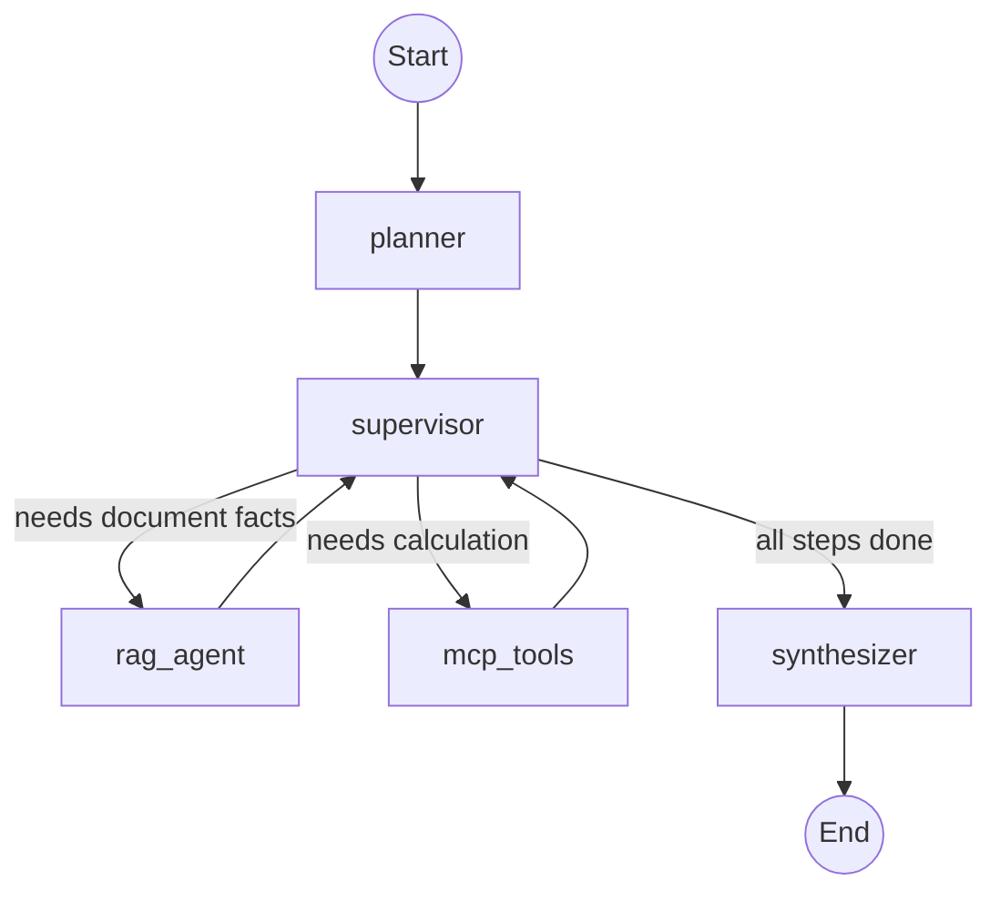

# AGENTIC AI & LLMOPS
## CS 4603 · PROGRAMMING ASSIGNMENT 4
---
### LUMS SBASSE · SUMMER 2026

---

## Assignment Overview

This assignment takes you from a locally-running LangGraph agent to a **production-deployed service** on Databricks. You will build a multi-agent Document Analyst system, deploy it as a Model Serving endpoint, and write a client SDK to invoke it programmatically.

The core engineering decisions you will explore:

1. **Graph architecture:** How to decompose a complex task into cooperating agents with typed state, conditional routing, and tool integration.
2. **Deployment pipeline:** How to package a LangGraph application for production using MLflow models-from-code and Unity Catalog.
3. **Client engineering:** How to build a reliable client that authenticates, invokes, and handles errors from a deployed agent.

The assignment is organized around observable outcomes:

- You build working, modular code.
- You deploy a real endpoint and prove it responds.
- You explain architectural decisions, not just whether code runs.
- You treat deployment failures as engineering problems to debug.

---

## How the System Works: End-to-End Workflow

This section shows exactly what happens when a user sends a query to the Document Analyst.

### Example Query

> "What was Meridian's net revenue in fiscal year 2023, and what would it be after 3 years of 8% compound annual growth?"

### Step-by-Step Execution

```
┌─────────────────────────────────────────────────────────────────────────┐
│  USER QUERY                                                             │
│  "What was Meridian's net revenue in FY2023, and what would it be after │
│   3 years of 8% compound annual growth?"                                │
└────────────────────────────────┬────────────────────────────────────────┘
                                 │
                                 ▼
┌─────────────────────────────────────────────────────────────────────────┐
│  1. PLANNER NODE                                                        │
│                                                                         │
│  Input:  user query                                                     │
│  Action: LLM decomposes query into atomic steps                         │
│  Output: plan = [                                                       │
│            "Find Meridian's net revenue for fiscal year 2023",          │
│            "Calculate compound growth: revenue × (1.08)^3",            │
│            "Present both the original and projected figures"            │
│          ]                                                              │
│  Sets:   current_step_index = 0                                         │
└────────────────────────────────┬────────────────────────────────────────┘
                                 │
                                 ▼
┌─────────────────────────────────────────────────────────────────────────┐
│  2. SUPERVISOR NODE  (iteration 1)                                      │
│                                                                         │
│  Input:  plan[0] = "Find Meridian's net revenue for fiscal year 2023"  │
│  Action: LLM classifies step → needs document lookup                    │
│  Output: next_agent = "rag_agent"                                       │
└────────────────────────────────┬────────────────────────────────────────┘
                                 │
                                 ▼
┌─────────────────────────────────────────────────────────────────────────┐
│  3. RAG AGENT                                                           │
│                                                                         │
│  Input:  "Find Meridian's net revenue for fiscal year 2023"            │
│  Action: Embeds query → retrieves top-k chunks from vector store        │
│          → extracts the relevant fact                                    │
│  Output: step_results += ["Meridian's net revenue in FY2023 was         │
│           ¥16.91 trillion (source: annual_report.pdf, page 4)"]        │
│  Sets:   current_step_index = 1                                         │
└────────────────────────────────┬────────────────────────────────────────┘
                                 │
                                 ▼ (returns to supervisor)
┌─────────────────────────────────────────────────────────────────────────┐
│  4. SUPERVISOR NODE  (iteration 2)                                      │
│                                                                         │
│  Input:  plan[1] = "Calculate compound growth: revenue × (1.08)^3"     │
│  Action: LLM classifies step → needs calculation                        │
│  Output: next_agent = "mcp_tools"                                       │
└────────────────────────────────┬────────────────────────────────────────┘
                                 │
                                 ▼
┌─────────────────────────────────────────────────────────────────────────┐
│  5. MCP TOOLS (via MCP Server)                                          │
│                                                                         │
│  Input:  growth_rate(start_value=16.91, rate=0.08, years=3)            │
│  Action: MCP server computes 16.91 × (1.08)^3                          │
│  Output: step_results += ["16.91 trillion × (1.08)^3 = 21.30           │
│           trillion after 3 years at 8% CAGR"]                          │
│  Sets:   current_step_index = 2                                         │
└────────────────────────────────┬────────────────────────────────────────┘
                                 │
                                 ▼ (returns to supervisor)
┌─────────────────────────────────────────────────────────────────────────┐
│  6. SUPERVISOR NODE  (iteration 3)                                      │
│                                                                         │
│  Input:  plan[2] = "Present both the original and projected figures"   │
│  Action: All steps complete → route to synthesis                        │
│  Output: next_agent = "synthesizer"                                     │
└────────────────────────────────┬────────────────────────────────────────┘
                                 │
                                 ▼
┌─────────────────────────────────────────────────────────────────────────┐
│  7. SYNTHESIZER NODE                                                    │
│                                                                         │
│  Input:  step_results = [revenue fact, growth calculation]              │
│  Action: LLM combines results into a coherent answer with citations     │
│  Output: final_answer =                                                 │
│    "Meridian's net revenue in FY2023 was ¥16.91 trillion [source:      │
│     annual_report.pdf, p.4]. Applying an 8% compound annual growth     │
│     rate over 3 years, the projected revenue would be approximately    │
│     ¥21.30 trillion (16.91 × 1.08³)."                                 │
└────────────────────────────────┬────────────────────────────────────────┘
                                 │
                                 ▼
                              [ END ]
```

### Graph Visualization



### Key Design Decisions

| Decision | Choice | Why |
|----------|--------|-----|
| Planning first | Explicit plan before execution | LLM sees the full picture; steps are auditable |
| Supervisor loop | Route per step, return to supervisor | Handles mixed retrieval + computation queries |
| RAG separate from tools | Dedicated retrieval node | Cleaner prompts, can tune retrieval independently |
| MCP for math | External tool server | Deterministic calculations, no LLM hallucination on math |
| Synthesizer at end | Single final generation | Coherent answer with proper citations |

---

### Prerequisites

You should already be comfortable with:

- LangGraph: state schemas, nodes, conditional edges, tool nodes, subgraphs (wk5 notebooks 1–14)
- RAG on Databricks: `ai_prep_search` chunking, managed embeddings, **Vector Search** retrieval (PA2 Part 1)
- MLflow: experiment logging, model registration (PA1–PA3)
- Databricks Model Serving and Unity Catalog (wk5 notebook 15)

> **Everything runs on Databricks.** Unlike PA2 (which used a local pgvector container for Parts 2–3), PA4 uses **Databricks Vector Search** end-to-end — the same managed index works locally *and* inside the deployed serving container, so there is no local-vs-cloud retrieval gap to bridge.

Course repository: https://github.com/alikhawaja/cs4603

Use `wk5_langgraph/15.databricks_deployment/` as the primary reference for deployment patterns.

---

## Points

| Part | Topic | Points |
|------|-------|--------|
| 1 | Document Analyst: LangGraph Multi-Agent App | 40 |
| 2 | Databricks Deployment | 40 |
| 3 | Python Client SDK | 20 |
| Bonus A | GitHub Actions CI/CD Pipeline | 15 |
| Bonus B | Deployment via `databricks-agents` SDK | 15 |
| Bonus C | Deploy the MCP server separately on Databricks | 15 |
| **Total** | | **100 + 45 bonus** |

---

## Suggested Directory Structure

Files marked `[GIVEN]` are supplied. Files marked `[STUDENT]` are yours to create.

```
PA-4/
├── .env.example                    # [GIVEN]
├── pyproject.toml                  # [GIVEN]
├── config.py                       # [GIVEN] — env loading + LLM client factory
├── README.md                       # [STUDENT]
├── pa4.ipynb                       # [STUDENT] — development & testing notebook
│
├── data/
│   ├── annual_report.pdf           # [GIVEN] — the corpus to ingest (Meridian Motor Corp, fictional)
│   ├── annual_report.md            # [GIVEN] — readable version of the same report
│   └── generate_report.py          # [GIVEN] — script that produced the report
│
├── agent/
│   ├── __init__.py                 # [STUDENT]
│   ├── state.py                    # [STUDENT] — state schema definitions
│   ├── planner.py                  # [STUDENT] — planner node
│   ├── supervisor.py               # [STUDENT] — supervisor routing node
│   ├── rag_agent.py                # [STUDENT] — RAG retrieval subgraph
│   ├── synthesizer.py              # [STUDENT] — synthesis node
│   ├── graph.py                    # [STUDENT] — full compiled graph
│   └── prompts.py                  # [STUDENT] — all system prompts
│
├── rag/
│   ├── ingest.py                   # [STUDENT] — parse + chunk into a Delta table
│   └── store.py                    # [STUDENT] — Vector Search index + retriever
│
├── tools/
│   └── mcp_server.py              # [GIVEN] — MCP server with math/finance tools
│
├── deployment/
│   ├── agent_model.py             # [STUDENT] — MLflow models-from-code definition
│   ├── deploy.py                  # [STUDENT] — deployment script
│   ├── deploy_agents.py           # [STUDENT] — (Bonus B) databricks-agents deployment
│   └── mcp_app/                   # [STUDENT] — (Bonus C) standalone MCP server as a Databricks App
│       ├── app.py                 # [STUDENT] — (Bonus C) HTTP-transport MCP entrypoint
│       └── app.yaml               # [STUDENT] — (Bonus C) Databricks App config
│
├── client/
│   ├── __init__.py                # [STUDENT]
│   └── sdk.py                     # [STUDENT] — client SDK
│
├── tests/
│   └── test_smoke.py             # [STUDENT] — offline graph smoke test (Bonus A target)
│
└── .github/
    └── workflows/
        └── deploy.yml             # [STUDENT] — (Bonus A) CI/CD pipeline
```

---

## PART 0: Setup [0 Points]

### Task 0.1: Environment Setup

Set up your environment using `uv` as in previous assignments.

```bash
uv sync
```

Your `.env` must contain:

```
DATABRICKS_HOST=https://<your-workspace>.databricks.com
DATABRICKS_TOKEN=dapi...
DATABRICKS_MODEL=databricks-meta-llama-3-3-70b-instruct
EMBEDDINGS_ENDPOINT=databricks-gte-large-en

# Unity Catalog + Vector Search (used by rag/ and deployment/)
UC_CATALOG=main
UC_SCHEMA=default
VECTOR_SEARCH_ENDPOINT=<your-name>-vs-endpoint
VECTOR_SEARCH_INDEX=main.default.<your-name>_analyst_index
```

> **Auth note — why a token, not a CLI profile.** PA3 authenticated through a `DATABRICKS_CONFIG_PROFILE`. PA4 switches to an explicit **Personal Access Token** (`DATABRICKS_TOKEN`) because (a) the deployed serving container has no interactive CLI profile — it reads the token from a secret scope at startup, and (b) the Bonus A CI/CD pipeline runs headless in GitHub Actions. Same credential, delivered as an env var so it works identically on your laptop, in the endpoint, and in CI. Never hardcode it.

### Task 0.2: Verify the MCP Server

The provided `tools/mcp_server.py` exposes the following tools via MCP:

| Tool | Description |
|------|-------------|
| `calculate` | Evaluate a math expression (supports +, -, *, /, ** ) |
| `percentage_change` | Compute % change between two values |
| `growth_rate` | Compute compound annual growth rate (CAGR) |
| `compare_values` | Compare two numbers and return which is larger and by how much |
| `unit_convert` | Convert between financial-reporting scale units (thousand/million/billion/trillion) and percent ↔ ratio |

Start the server and confirm it responds:

```bash
uv run python tools/mcp_server.py
```

### Task 0.3: Ingest the Corpus into Vector Search

You are provided a financial document — `data/annual_report.pdf`, the FY2023 annual report of **Meridian Motor Corporation** (a fictional automaker; all figures are synthetic). Ingest it into a **Databricks Vector Search** index using the pipeline you learned in **PA2 Part 1**:

1. Upload `data/annual_report.pdf` to a Unity Catalog volume (e.g. `/Volumes/main/default/pa4/`) and parse it with `ai_parse_document`.
2. Chunk the parsed output with `ai_prep_search` into a Delta table (columns `chunk_id`, `chunk_to_retrieve`, `chunk_to_embed`, plus `source`/`page` metadata).
3. Create a **STANDARD** Vector Search endpoint and a **Delta Sync index** with managed embeddings (`pipeline_type="TRIGGERED"`, `primary_key="chunk_id"`, `embedding_source_column="chunk_to_retrieve"`, `embedding_model_endpoint_name=$EMBEDDINGS_ENDPOINT`).
4. Verify the index reaches `READY` and answers a similarity-search test query.

**Reference:** PA2 Part 1 (Vector Search walkthrough) and `wk5_langgraph/8.langgraph_rag/` for the LangGraph + retriever wiring pattern (adapt its pgvector retriever to `DatabricksVectorSearch`).

> This is the only vector store in PA4. Because the index lives in Databricks, the exact same retriever code runs locally and inside your deployed endpoint (Part 2) — no separate embedding path for deployment.

---

## PART 1: Document Analyst — LangGraph Multi-Agent App [40 Points]

**Goal:** Build a multi-agent system that can answer complex questions requiring both document retrieval AND computation.

### Overview

A single ReAct agent struggles with multi-step analytical queries like:

> "What was the reported revenue in 2023, and what would it be after a 12% growth rate applied for 2 years?"

This requires: (1) finding the revenue figure in a document, (2) computing compound growth. Your Document Analyst breaks this into cooperating agents.

**Architecture:**

```
User Query → Planner → Supervisor → [RAG Agent | MCP Tools] → Synthesizer → Answer
                           ↑                    |
                           └────────────────────┘
                            (loop until all steps done)
```

---

### Task 1.1: Define the State Schema [5 pts]

**File:** `agent/state.py`

**Reference:** `wk5_langgraph/3a.annotations.ipynb` and `wk5_langgraph/3b.reducers.ipynb`

#### IMPLEMENTATION

Define a `TypedDict` state that tracks:

| Field | Type | Purpose |
|-------|------|---------|
| `messages` | `Annotated[list, add_messages]` | Conversation history |
| `plan` | `list[str]` | Ordered list of planned steps |
| `current_step_index` | `int` | Which step is being executed |
| `step_results` | `list[str]` | Results from completed steps |
| `next_agent` | `str` | Routing decision from supervisor |
| `final_answer` | `str` | Synthesized response |

---

### Task 1.2: Build the Planner Node [8 pts]

**File:** `agent/planner.py`

**Reference:** `wk5_langgraph/11.plan_and_execute.ipynb`

#### IMPLEMENTATION

The planner receives the user query and produces a list of 2–5 atomic steps.

- Use a system prompt that instructs the LLM to decompose analytical queries into retrieval steps and computation steps
- Output must be a JSON list of step strings
- Handle parse failures gracefully (fallback to single-step)
- Steps should be categorized implicitly: steps needing document facts vs. steps needing calculation

#### ANALYSIS QUESTIONS

1. What happens when the planner produces steps that depend on each other (e.g., step 3 needs the result of step 1)? How does your architecture handle this?
2. Would a replanning step after each execution improve or hurt performance for this use case? Justify with an example.

---

### Task 1.3: Build the Supervisor Node [8 pts]

**File:** `agent/supervisor.py`

**Reference:** `wk5_langgraph/10.multi_agent.ipynb`

#### IMPLEMENTATION

The supervisor reads the current step and routes to the appropriate specialist:

- Route to `rag_agent` when the step requires looking up facts from the document
- Route to `mcp_tools` when the step requires calculation or numerical analysis
- Route to `synthesizer` when all steps are complete
- Use structured output or keyword parsing for routing decisions

Implement the conditional edge function that maps the supervisor's `next_agent` decision to the correct graph node.

#### ANALYSIS QUESTIONS

1. Your supervisor makes a routing decision per step. What is the failure mode if it misroutes? How would you detect and recover from a misroute?
2. Compare this supervisor pattern with a single ReAct agent that has access to all tools. When is the supervisor pattern worth the added complexity?

---

### Task 1.4: Build the RAG Agent [10 pts]

**File:** `agent/rag_agent.py`

**Reference:** PA2 Part 1 (Vector Search + `DatabricksVectorSearch`) and `wk5_langgraph/8.langgraph_rag/`

#### IMPLEMENTATION

Build a RAG retrieval node (or subgraph) that:

- Connects to the **Vector Search index** built in Task 0.3 via `DatabricksVectorSearch` (from `databricks-langchain`)
- Retrieves top-k relevant chunks for the current step's query
- Formats retrieved documents with source citations
- Returns the extracted fact as a step result
- Handles empty retrieval gracefully (returns "not found in documents")

Reuse your `rag/store.py` retriever factory so the identical code path serves both local testing and the deployed endpoint. Do **not** stand up any local database — retrieval is a managed Databricks call authenticated by `DATABRICKS_HOST`/`DATABRICKS_TOKEN`.

#### ANALYSIS QUESTIONS

1. The RAG agent retrieves for a single decomposed step, not the full user query. How does this affect retrieval quality compared to retrieving for the original question?
2. If the planner produces a vague step like "find relevant financial data," how would you improve the retrieval query before sending it to the vector store?

---

### Task 1.5: Connect MCP Tools [4 pts]

**File:** `agent/graph.py` (MCP integration)

**Reference:** `wk4_langchain_agents_mcp/` for MCP client patterns

#### IMPLEMENTATION

Connect the provided MCP server as a tool node in your graph:

- Start the MCP server as a subprocess or connect via stdio
- Bind the MCP tools to a tool node that the supervisor can route to
- Parse tool results and append them to `step_results`

> **Caveat — stdio MCP + `asyncio` in the serving container.** `langchain-mcp-adapters`
> tools are async, so you will wrap calls in `asyncio.run(...)`. That works in MLflow's
> synchronous serving path, but `asyncio.run()` raises *"cannot be called from a running
> event loop"* if invoked while a loop is already running, and each stdio tool call may
> relaunch the `mcp_server.py` subprocess. This is the most fragile part of the deployment:
> load the tools once at graph-build time, keep tool invocation synchronous, and test the
> deployed endpoint end-to-end (Task 2.4) rather than assuming local success transfers.

---

### Task 1.6: Build the Synthesizer [5 pts]

**File:** `agent/synthesizer.py`

#### IMPLEMENTATION

The synthesizer receives all step results and produces a coherent final answer:

- Combine all step results into context
- Generate a clear, cited answer that references which step produced which fact
- Handle partial failures (some steps returned "not found")
- Write the final answer to **both** `final_answer` **and** the `messages` channel as an `AIMessage`

> **Why append to `messages`?** Your deployed endpoint (Part 2) exposes an OpenAI-compatible chat API. MLflow serves the graph with a *messages-in → messages-out* contract: the request arrives as `{"messages": [...]}` and the response is read from the **last message** in the returned state. If the synthesizer only sets `final_answer` and never appends an `AIMessage`, the endpoint will return an empty completion even though your local state looks correct. Keep `messages` (with the `add_messages` reducer) as the entry and exit channel; the extra fields (`plan`, `step_results`, …) are internal scratch space.

---

### Task 1.7: Wire the Full Graph [required — up to 5 make-up pts within Part 1's 40]

**File:** `agent/graph.py`

**Reference:** `wk5_langgraph/12.subgraphs.ipynb` for composition patterns

> **Points note.** Tasks 1.1–1.6 already total the full 40 points for Part 1. Wiring the
> graph here is **required** (nothing runs without it), but its 5 points are *make-up*
> credit: they can offset marks lost in 1.1–1.6 and cannot push Part 1 above its 40-point cap.

#### IMPLEMENTATION

Assemble the full graph:

```python
builder = StateGraph(AnalystState)
builder.add_node("planner", planner)
builder.add_node("supervisor", supervisor)
builder.add_node("rag_agent", rag_agent)
builder.add_node("mcp_tools", mcp_tools)
builder.add_node("synthesizer", synthesizer)

builder.add_edge(START, "planner")
builder.add_edge("planner", "supervisor")
builder.add_conditional_edges("supervisor", route_from_supervisor)
builder.add_edge("rag_agent", "supervisor")
builder.add_edge("mcp_tools", "supervisor")
builder.add_edge("synthesizer", END)

graph = builder.compile()
```

**Notebook work (pa4.ipynb):**

1. Visualize the compiled graph
2. Test with a retrieval-only query (e.g., "What was the net income in 2023?")
3. Test with a computation-only query (e.g., "What is 15% of 2.4 billion?")
4. Test with a combined query (e.g., "What was the revenue in 2023, and what would a 10% increase look like?")
5. Show the step-by-step execution trace for the combined query

---

## PART 2: Databricks Deployment [40 Points]

**Goal:** Package your Document Analyst as an MLflow model and deploy it to a Databricks Model Serving endpoint.

**Reference:** `wk5_langgraph/15.databricks_deployment/` — study `agent.py`, `deploy_setup.py`, and `deployment.ipynb` thoroughly before starting.

> **See [`DEPLOYMENT_GUIDE.md`](DEPLOYMENT_GUIDE.md) for complete details** on the manual
> deployment path — the mental model, the five PA4-specific differences, the serving
> container internals, secret scopes, and the READY lifecycle.

---

### Task 2.1: Create the Model Definition [10 pts]

**File:** `deployment/agent_model.py`

**Reference:** `wk5_langgraph/15.databricks_deployment/agent.py`

#### IMPLEMENTATION

Create a self-contained model file that MLflow can serialize via models-from-code:

- Import and rebuild your graph (all dependencies must be importable from this single file or its local imports)
- Configure `ChatOpenAI` to read credentials from environment variables (`base_url = $DATABRICKS_HOST/serving-endpoints`)
- Validate required env vars at import time and raise a clear error if any are missing (so serving logs show the cause instead of a cryptic `DEPLOYMENT_FAILED`)
- End with `mlflow.models.set_model(graph)` so MLflow knows what to serve
- The file must import cleanly: `python -c "import deployment.agent_model"`

**RAG in deployment:** Retrieval uses the **Databricks Vector Search index** from Task 0.3. Because the index is a managed Databricks service reachable with `DATABRICKS_HOST`/`DATABRICKS_TOKEN`, the serving container queries it exactly as your local code does — **no code change and no separate embedding path for deployment.** (Contrast with a local pgvector container, which the serving container could never reach.) This is the payoff of going all-Databricks in Task 0.3.

#### ANALYSIS QUESTIONS

1. Why does `models-from-code` require a self-contained file? What breaks if you reference external state (e.g., a database running only on your laptop)?
2. Your model calls a managed Vector Search index at inference time rather than embedding documents into the container image. What are the tradeoffs (freshness, cold-start size, latency, failure modes) of querying an external index vs. baking the corpus into the model artifact?

---

### Task 2.2: Log and Register the Model [10 pts]

**File:** `deployment/deploy.py`

**Reference:** `wk5_langgraph/15.databricks_deployment/deploy_setup.py`

#### IMPLEMENTATION

Write a deployment script that:

1. Sets the MLflow tracking URI, the **Unity Catalog registry** (`mlflow.set_registry_uri("databricks-uc")`), and the experiment
2. Logs the model using `mlflow.langchain.log_model()` with:
   - `lc_model` pointing to your `agent_model.py`
   - `code_paths` listing your local packages (`agent`, `rag`, `tools`, `config.py`) so the serving container can import them — **without this the endpoint fails at startup with `ModuleNotFoundError: No module named 'agent'` (the #1 PA4 deployment error)**
   - Appropriate `pip_requirements` for all dependencies (`mlflow`, `langgraph`, `langchain-openai`, `databricks-langchain`, `databricks-vectorsearch`, `mcp`, …)
   - An `input_example` showing the expected message format
3. Registers the model in Unity Catalog (`$UC_CATALOG.$UC_SCHEMA.<your_model_name>`)
4. Prints the registered model version

```python
# Expected pattern:
mlflow.set_registry_uri("databricks-uc")
with mlflow.start_run():
    model_info = mlflow.langchain.log_model(
        lc_model=os.path.join(os.path.dirname(__file__), "agent_model.py"),
        name="agent",  # newer MLflow uses name= (older used artifact_path=)
        code_paths=[   # ship your local packages so the container can import them
            os.path.join(root, "agent"),
            os.path.join(root, "rag"),
            os.path.join(root, "tools"),
            os.path.join(root, "config.py"),
        ],
        pip_requirements=[...],
        input_example={"messages": [{"role": "user", "content": "What was the revenue?"}]},
    )
registered = mlflow.register_model(model_info.model_uri, f"{catalog}.{schema}.{model_name}")
```

**Run:** `uv run python deployment/deploy.py`

---

### Task 2.3: Create the Serving Endpoint [10 pts]

**File:** `deployment/deploy.py` (continued)

#### IMPLEMENTATION

Extend your deployment script to create or update a Model Serving endpoint:

- Use the Databricks Python SDK (`databricks.sdk.WorkspaceClient`) with `EndpointCoreConfigInput` / `ServedEntityInput`
- Configure the endpoint with:
  - `served_entities` pointing to your registered model version
  - `workload_size="Small"`, `scale_to_zero_enabled=True`
  - `environment_vars` for `DATABRICKS_TOKEN`, `DATABRICKS_HOST`, `DATABRICKS_MODEL` supplied as **secret references** (never plaintext)
  - `environment_vars` for `VECTOR_SEARCH_ENDPOINT`, `VECTOR_SEARCH_INDEX`, and `EMBEDDINGS_ENDPOINT` so the container's retriever can reach the index — **without these `rag/store.py` raises at startup and the endpoint fails.** These are not secrets, so plaintext values are fine.
- Wait for the endpoint to reach `READY` state
- Print the endpoint URL

**Secrets first.** The serving container has no `.env`. Store credentials once in a secret scope, then reference them from the endpoint config:

```bash
databricks secrets create-scope cs4603-deploy
databricks secrets put-secret cs4603-deploy DATABRICKS_TOKEN --string-value "dapi..."
databricks secrets put-secret cs4603-deploy DATABRICKS_HOST  --string-value "https://<workspace>.databricks.com"
databricks secrets put-secret cs4603-deploy DATABRICKS_MODEL --string-value "databricks-meta-llama-3-3-70b-instruct"
```

```python
environment_vars={
    "DATABRICKS_HOST":  "{{secrets/cs4603-deploy/DATABRICKS_HOST}}",
    "DATABRICKS_TOKEN": "{{secrets/cs4603-deploy/DATABRICKS_TOKEN}}",
    "DATABRICKS_MODEL": "{{secrets/cs4603-deploy/DATABRICKS_MODEL}}",
    # Not secrets — the retriever needs these to reach the Vector Search index:
    "VECTOR_SEARCH_ENDPOINT": "<your-vs-endpoint>",
    "VECTOR_SEARCH_INDEX":    "<your-index>",
    "EMBEDDINGS_ENDPOINT":    "databricks-gte-large-en",
}
```

**Verify:**
```bash
databricks serving-endpoints get <your-endpoint-name>
```

#### ANALYSIS QUESTIONS

1. Why must you pass `DATABRICKS_TOKEN` as an environment variable to the endpoint, even though it's already authenticated to serve models?
2. What happens to in-flight requests when you deploy a new model version to the same endpoint? How does Databricks handle the transition?

---

### Task 2.4: Test the Deployed Endpoint [10 pts]

**Notebook work (pa4.ipynb):**

1. Call the endpoint using `curl` and show the raw response
2. Call the endpoint using the OpenAI Python SDK and show the parsed response
3. Run the same 3 test queries from Task 1.7 against the deployed endpoint
4. Compare local vs. deployed responses — are they identical? If not, explain why
5. Measure and report: latency per request (cold start vs. warm)

```python
import openai

client = openai.OpenAI(
    api_key=DATABRICKS_TOKEN,
    base_url=f"{DATABRICKS_HOST}/serving-endpoints",
)

response = client.chat.completions.create(
    model="<your-endpoint-name>",
    messages=[{"role": "user", "content": "What was the net income in 2023?"}],
)
```

---

## PART 3: Python Client SDK [20 Points]

**Goal:** Build a reusable Python client library that any downstream application can use to invoke your deployed Document Analyst.

---

### Task 3.1: Client Class [12 pts]

**File:** `client/sdk.py`

#### IMPLEMENTATION

```python
class DocumentAnalystClient:
    def __init__(
        self,
        endpoint_name: str,
        host: str | None = None,
        token: str | None = None,
        timeout: float = 120.0,
        max_retries: int = 3,
    ) -> None: ...

    def ask(self, question: str) -> str: ...
    def ask_streaming(self, question: str) -> Iterator[str]: ...
    def health_check(self) -> bool: ...
```

Requirements:

- **Authentication:** Read `DATABRICKS_HOST` and `DATABRICKS_TOKEN` from environment when not provided explicitly
- **Retry logic:** Implement exponential backoff for 429 (rate limit) and 503 (endpoint scaling) responses
- **Timeout handling:** Raise a clear `TimeoutError` with the elapsed time
- **Streaming:** `ask_streaming()` yields text chunks as they arrive from the endpoint
- **Health check:** Verify the endpoint is in `READY` state before sending queries
- **Error handling:** Wrap HTTP errors into a custom `AnalystClientError` with status code, message, and request ID

> **Caveat — streaming may not emit token deltas.** A models-from-code LangChain endpoint
> returns a single completion unless it implements `predict_stream`; it may not stream
> OpenAI-style `choices[].delta` chunks. Implement `ask_streaming()` to parse SSE
> (`data: ...` lines) correctly, but treat a single-chunk (non-incremental) response as a
> valid outcome — fall back to yielding the full answer once rather than assuming
> token-by-token deltas always arrive.

---

### Task 3.2: Demonstrate the Client [8 pts]

**Notebook work (pa4.ipynb):**

1. Import and instantiate `DocumentAnalystClient`
2. Run `health_check()` and assert it returns `True`
3. Call `ask()` with a simple query and display the result
4. Call `ask_streaming()` and print chunks as they arrive
5. Simulate a timeout (set `timeout=0.001`) and show the error handling
6. Simulate the endpoint being unavailable and show retry behavior

#### ANALYSIS QUESTIONS

1. Why is exponential backoff better than fixed-interval retries for a model serving endpoint?
2. Your client has a `max_retries` parameter. What is the danger of setting it too high in a production system with many concurrent users?
3. When would you choose `ask_streaming()` over `ask()`? Give a concrete UX example.

---

## BONUS A: GitHub Actions CI/CD Pipeline [15 Points]

**Goal:** Automate the deployment pipeline so that pushing to `main` triggers a lint → test → deploy workflow.

**File:** `.github/workflows/deploy.yml`

> **New to CI/CD or GitHub Actions?** Read [`GITHUB_PIPELINE.md`](GITHUB_PIPELINE.md) first —
> it covers the basics of pipelines, GitHub Actions concepts (workflows, jobs, steps,
> runners, secrets), and step-by-step guidelines for completing this bonus.

---

### Implementation

Create a GitHub Actions workflow that:

1. **Lint** — Run `ruff check` on the `agent/` and `client/` directories
2. **Test** — Run a basic smoke test that imports the graph and compiles it without errors
3. **Deploy** — On push to `main` only:
   - Log the model to MLflow
   - Register a new version in Unity Catalog
   - Update the serving endpoint to the new version

**Requirements:**

- Use GitHub Secrets for `DATABRICKS_HOST` and `DATABRICKS_TOKEN`
- The deploy step must only run after lint and test pass
- Include a manual trigger (`workflow_dispatch`) for ad-hoc deployments
- Print the deployed model version and endpoint status at the end

#### ANALYSIS QUESTIONS

1. Why should the deploy step only run on `main` and not on feature branches?
2. What would you add to this pipeline to prevent deploying a model that performs worse than the current version? Describe the gate.

---

## BONUS B: Deployment via `databricks-agents` SDK [15 Points]

**Goal:** Deploy the same agent using the newer `databricks-agents` SDK as an alternative to the manual MLflow approach earlier in the assignment.

**File:** `deployment/deploy_agents.py`

**Reference:** `wk5_langgraph/16.databricks_deployment_v2/` — study `agent_chat.py` and `deployment_v2.ipynb`, which deploy the same agent via `agents.deploy()` with automatic authentication (no secret scope). This is the v2 counterpart to the `15.databricks_deployment/` reference used in Part 2.

> **See [`DEPLOYMENT_GUIDE.md`](DEPLOYMENT_GUIDE.md) for complete details.** The
> `agents.deploy()` path reuses the entire manual pipeline unchanged — you only swap the
> final `WorkspaceClient` deploy step for a single `agents.deploy(...)` call, so read the
> guide first to understand what that one call replaces.

---

### Implementation

```bash
pip install databricks-agents
```

Use the `databricks-agents` SDK to deploy your agent:

```python
from databricks import agents

# Log the agent (same models-from-code definition + code_paths as Part 2)
with mlflow.start_run():
    model_info = mlflow.langchain.log_model(
        lc_model="deployment/agent_model.py",
        name="agent",
        code_paths=["agent", "rag", "tools", "config.py"],
        pip_requirements=[...],
    )

# Register in Unity Catalog, then deploy with one call
registered = mlflow.register_model(model_info.model_uri, f"{catalog}.{schema}.{model_name}")
deployment = agents.deploy(
    model_name=f"{catalog}.{schema}.{model_name}",
    model_version=registered.version,
    scale_to_zero=True,
)
print(deployment.endpoint_name)
print(deployment.review_app_url)

# The SDK auto-provisions:
# - A serving endpoint
# - A review app for human feedback
```

**Requirements:**

1. Deploy using `agents.deploy()`
2. Open the auto-generated **Review App** and submit 3 queries with feedback ratings
3. Show the feedback in the MLflow experiment

#### ANALYSIS QUESTIONS

1. Compare the `agents.deploy()` approach with the manual MLflow + CLI approach from Part 2. What control do you gain or lose with each?
2. The Review App enables human feedback collection. How would you use this feedback to improve the agent over time? Describe a concrete feedback loop.

---

## BONUS C: Deploy the MCP Server Separately on Databricks [15 Points]

**Goal:** Stop bundling the MCP server inside the model artifact. Instead, deploy
`tools/mcp_server.py` as its **own standalone service** on Databricks and have your
agent connect to it **remotely over HTTP** — the way real systems separate a tool
service from the model that calls it.

**Files:** `deployment/mcp_app/app.py`, `deployment/mcp_app/app.yaml`

**Reference:** `wk4_langchain_agents_mcp/` for MCP transports, and the Databricks Apps
documentation for hosting a custom web service.

---

### Why this is different from Part 1's MCP integration

In Part 1 (Task 1.5) your graph launches the MCP server as a **stdio subprocess** and
ships its code inside the serving container via `code_paths`. That couples the tool
server to the model: they scale together, deploy together, and the in-container
`asyncio`/subprocess handling is the most fragile part of the deployment.

Bonus C decouples them. The MCP server runs as a long-lived HTTP service; the agent is
just a **client** that connects to its URL. Now the tool server can be redeployed,
scaled, and monitored independently of the model.

```
Part 1/2:  agent  ──stdio subprocess──▶  mcp_server.py   (inside the container)
Bonus C:   agent  ──HTTPS + bearer────▶  MCP server        (separate Databricks App)
```

---

### Implementation

1. **Switch the server to an HTTP transport.** `tools/mcp_server.py` is GIVEN and uses
   the stdio transport (`mcp.run()`). For a hosted service, run FastMCP with the
   **streamable-http** transport instead. Create `deployment/mcp_app/app.py` that imports
   the same tools and serves them over HTTP:

   ```python
   # deployment/mcp_app/app.py
   from tools.mcp_server import mcp   # reuse the GIVEN tool definitions

   if __name__ == "__main__":
       # Databricks Apps provides the port via $DATABRICKS_APP_PORT (default 8000).
       mcp.run(transport="streamable-http")
   ```

2. **Deploy it as a Databricks App.** Add an `app.yaml` describing the run command, then
   create and deploy the app with the CLI:

   ```yaml
   # deployment/mcp_app/app.yaml
   command: ["python", "deployment/mcp_app/app.py"]
   ```

   ```bash
   databricks apps create cs4603-mcp-tools
   databricks apps deploy cs4603-mcp-tools --source-code-path <workspace-path>
   ```

3. **Point the agent at the remote server.** Change `load_mcp_tools()` in `agent/graph.py`
   so that when an MCP **URL** is configured it connects over streamable HTTP (with a
   bearer token) instead of spawning a subprocess:

   ```python
   client = MultiServerMCPClient({
       "analyst": {
           "url": f"{mcp_url}/mcp",
           "transport": "streamable_http",
           "headers": {"Authorization": f"Bearer {token}"},
       }
   })
   ```

4. **Wire the URL through config/env.** Add `MCP_SERVER_URL` to `.env` / the endpoint
   `environment_vars` so both local runs and the deployed model reach the hosted server.
   When `MCP_SERVER_URL` is unset, fall back to the Part 1 stdio behavior.

**Requirements:**

1. The MCP server is deployed as a **separate** Databricks App with a reachable HTTPS URL.
2. `databricks apps list` (or the Apps UI) shows the app in a **running** state.
3. Your agent answers a calculation query using the **remote** MCP server — prove it by
   temporarily stopping the app and showing the calculation step now fails.
4. The bundled model no longer needs the stdio subprocess for calculations (the tool
   traffic goes over HTTP).

#### ANALYSIS QUESTIONS

1. You moved the MCP server out of the model container. What did you gain (scaling,
   deployment, security, observability) and what new failure modes did you introduce
   (network, auth, latency, availability)?
2. The remote MCP server now needs its own authentication. How would you secure it so
   that only your serving endpoint — not the public internet — can call the tools?
3. When is bundling the tools in the container (Part 1) the *better* choice, and when is
   a separately deployed tool service (Bonus C) worth the extra moving parts?

---

## Grading Rubric

| Component | Points |
|-----------|--------|
| Part 1: Document Analyst (LangGraph multi-agent) | 40 |
| Part 2: Databricks Deployment (MLflow models-from-code) | 40 |
| Part 3: Python Client SDK | 20 |
| Bonus A: GitHub Actions CI/CD | 15 |
| Bonus B: `databricks-agents` SDK | 15 |
| Bonus C: Standalone MCP server on Databricks | 15 |
| **Total** | **100 + 45 bonus** |

**Note:** Written analysis responses account for approximately 25% of total points. Code that runs but is not understood will not receive full marks.

---

## Submission

Submit a single zip file containing:

- All source code in the prescribed directory structure
- Your completed `pa4.ipynb` with ALL OUTPUTS VISIBLE
- Your `README.md` with all analysis questions answered
- Do not include `.env`, virtual environment directories, or large binary/model files

Name your submission: `<roll_number>_pa4.zip`

---

## Reference Map

| Topic | Course Material |
|-------|----------------|
| State schemas & reducers | `wk5_langgraph/3a.annotations.ipynb`, `3b.reducers.ipynb` |
| Tool calling in LangGraph | `wk5_langgraph/4.tool_calling.ipynb` |
| Router / conditional edges | `wk5_langgraph/5.router.ipynb` |
| ReAct agent | `wk5_langgraph/6.agent.ipynb` |
| Agent memory & persistence | `wk5_langgraph/7.agent-memory.ipynb` |
| LangGraph + RAG | `wk5_langgraph/8.langgraph_rag/` (adapt retriever to Vector Search) |
| Human-in-the-loop | `wk5_langgraph/9.human_in_the_loop.ipynb` |
| Multi-agent patterns | `wk5_langgraph/10.multi_agent.ipynb` |
| Plan-and-execute | `wk5_langgraph/11.plan_and_execute.ipynb` |
| Subgraphs | `wk5_langgraph/12.subgraphs.ipynb` |
| Streaming | `wk5_langgraph/13.streaming.ipynb` |
| Deployment pipeline | `wk5_langgraph/15.databricks_deployment/` |
| Agent Framework deployment (`agents.deploy()`) | `wk5_langgraph/16.databricks_deployment_v2/` |
| MCP tool integration | `wk4_langchain_agents_mcp/` |
| Standalone MCP server on Databricks (Bonus C) | `wk4_langchain_agents_mcp/` (MCP transports) + Databricks Apps docs |
| RAG ingestion & Vector Search retrieval | PA2 Part 1 (Databricks Vector Search) |
